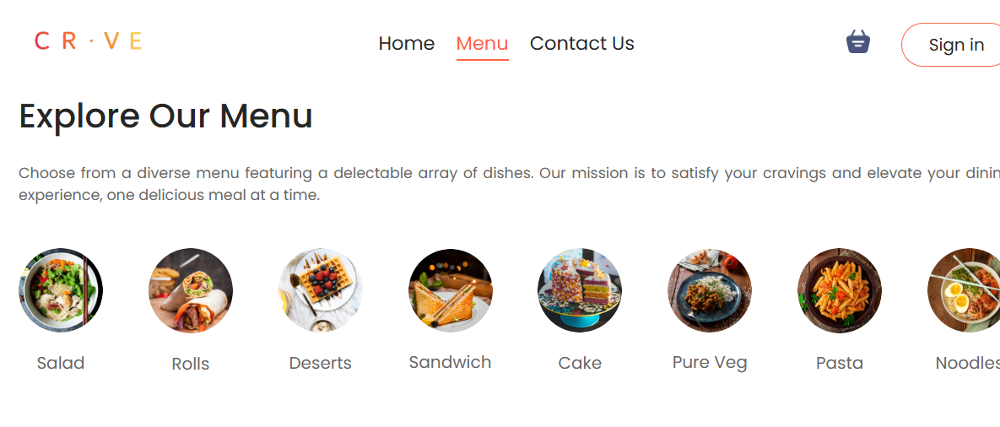
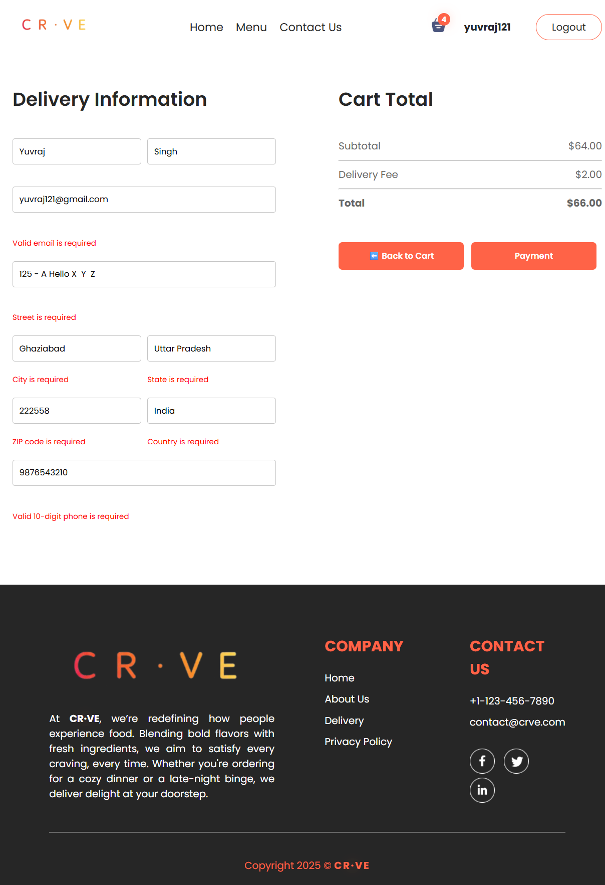
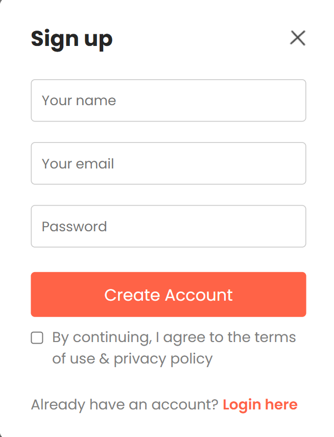

# 🍽️ CR.VE - IBM

A modern and responsive frontend food ordering website built using **React.js** and **Vite**.  
It simulates a real-world food delivery platform with features like browsing categorized menus, managing a cart, placing orders, and user authentication — all within a seamless SPA experience.

🔗 **Live Demo:** [cr-ve-ibm.vercel.app](https://cr-ve-ibm.vercel.app)  
🔗 **GitHub Repo:** [Food-Ordering-Website](https://github.com/0-YuvrajSingh/Food-Ordering-Website)

---

## 🚀 Features

- 🔐 Firebase Authentication (Login / Signup)
- 🧭 Explore food categories
- 🛒 Add/remove/update items in cart
- 📦 Place Order simulation with fake payment
- 🧩 SPA routing with React Router DOM
- 🔄 Cart state saved via localStorage
- 📱 Mobile responsive UI using custom CSS
- ⚡ Fast development environment with Vite

---

## 🛠️ Tech Stack

- **Frontend Framework:** React.js  
- **Build Tool:** Vite  
- **Authentication:** Firebase  
- **Routing:** React Router DOM  
- **Styling:** CSS3 + Media Queries  
- **Persistence:** React Hooks, Local Storage  
- **Version Control:** Git & GitHub  
- **Language:** JavaScript (ES6+)


---

## 📁 Project Structure

```bash
📁 Food-Ordering-Website
├── .env
├── .eslintrc.cjs
├── .gitignore
├── generateTree.js
├── index.html
├── LICENSE.txt
├── package-lock.json
├── package.json
├── README.md
├── vite.config.js
├── 📁 public
│   └── header_img.png
├── 📁 screenshots
│   ├── home_page.png
│   ├── menu.png
│   ├── cart.png
│   ├── checkout.png
│   └── sign_up.png
└── 📁 src
    ├── App.jsx
    ├── index.css
    ├── main.jsx
    ├── firebase.js
    ├── 📁 assets
    ├── 📁 components
    │   ├── ExploreMenu
    │   ├── FoodDisplay
    │   ├── FoodItem
    │   ├── Footer
    │   ├── Header
    │   ├── LoginPopup
    │   ├── Navbar
    │   ├── PrivateRoute.jsx
    │   └── UserMenu.jsx
    ├── 📁 context
    │   ├── AuthContext.jsx
    │   └── StoreContext.jsx
    └── 📁 pages
        ├── Cart
        ├── Home
        ├── Menu
        ├── Payment
        └── PlaceOrder
```
---

## 🖼️ Screenshots

Here are some key views of the application:

<br/>

### Homepage
[](screenshots/home_page.png)

### Menu
[](screenshots/menu.png)

### Cart
[](screenshots/cart.png)

### Checkout
[](screenshots/checkout.png)

### Sign Up
[](screenshots/sign_up.png)

---

## 📦 Setup Instructions

To run this project locally, follow these steps:

1.  **Clone the repository:**
    ```bash
    git clone [https://github.com/yourusername/your-repo-name.git](https://github.com/yourusername/your-repo-name.git)
    cd your-repo-name
    ```

2.  **Install dependencies:**
    ```bash
    npm install
    ```

3.  **Start the development server:**
    ```bash
    npm run dev
    ```

The application will be accessible at `http://localhost:5173`.

---

## 🎯 Roadmap

* [ ] **User Authentication:** Implement user sign-in and sign-up with a backend.
* [ ] **Payment Integration:** Add a secure payment gateway for checkout.
* [ ] **Order History:** Allow users to view their past orders.
* [ ] **Admin Panel:** Create an interface for managing menu items.

---

## 🤝 Contributing

Contributions are what make the open-source community an amazing place to learn, inspire, and create. Any contributions you make are **greatly appreciated**.

If you have a suggestion that would make this better, please fork the repo and create a pull request. You can also simply open an issue with the tag "enhancement".

1.  Fork the Project
2.  Create your Feature Branch (`git checkout -b feature/AmazingFeature`)
3.  Commit your Changes (`git commit -m 'Add some AmazingFeature'`)
4.  Push to the Branch (`git push origin feature/AmazingFeature`)
5.  Open a Pull Request

---

## 📄 License

Distributed under the MIT License. See `LICENSE.txt` for more information.

---

## 👨‍💻 Developed By

Yuvraj Singh
---